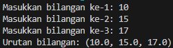
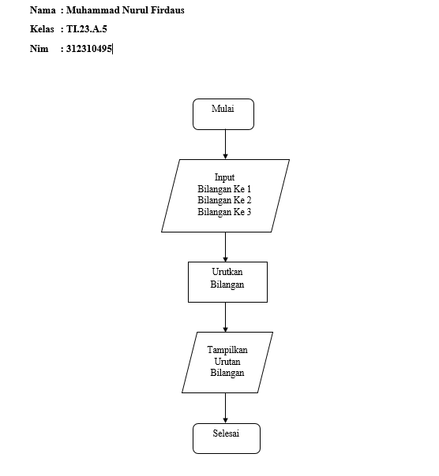

# Pertemuan 7 Bahasa Pemrograman
# Tugas Pertemuan 7
## Latihan 1 struktur kondisi
* Buat program sederhana dengan input 2 buah bilangan, kemudian tentukan bilangan terbesar dari kedua bilangan tersebut menggunakan statement if.
### Programnya:
``````python
bilangan1 = float(input("Masukan bilangan pertama : "))
bilangan2 = float(input("Masukan bilangan kedua : "))

if bilangan1 > bilangan2:
   bilangan_terbesar = bilangan1
else:
   bilangan_terbesar = bilangan2

   print("Bilangan terbesar adalah :", bilangan_terbesar )
``````
 ### Maka outputnya:


## Latihan 2 struktur kondisi
* Buat program untuk mengurutkan data berdasarkan input sejumlah data (minimal 3 variable input atau lebih), kemudian tampilkan hasilnya secara berurutan mulai dari data terkecil.
### Programnya:
``````python
# Meminta pengguna memasukkan 3 bilangan
print("Program mengurutkan data")
bil1 = int(input("Bilangan ke-1: "))
bil2 = int(input("Bilangan ke-2: "))
bil3 = int(input("Bilangan ke-3: "))

data = (bil2, bil3, bil1)

print("Urutan bilangan :", data)
``````
### Maka outputnya:



## Latihan 1 perulangan
* Buat program dengan perulangan bertingkat (nested) for yang menghasilkan output sebagai berikut:


### Programnya:
``````python
baris = 10
kolom = baris

for bar in range(baris):
    for col in range(kolom):
        tab = bar+col
        print("{0:>5}".format(tab), end='')
    print()
``````
### Maka outputnya:


## Latihan 2 perulangan
* Tampilkan n bilangan acak yang lebih kecil dari 0.5.
* nilai n diisi pada saat runtime
* anda bisa menggunakan kombinasi while dan for untuk
menyelesaikannya

### Programnya:
``````python
import random

n = int(input("Masukkan jumlah n: "))

count = 0

while count < n:
    bilangan = random.random()  # Menghasilkan bilangan acak antara 0 dan 1
    if bilangan < 0.5:
        print(bilangan)
        count += 1

``````
### Maka outputnya:


# Labspy2
# Praktikum 2
## Program untuk menentukan bilangan terbesar dari tiga bilangan
### Flowchartnya:



### Programnya:
``````python
# Membaca input dari pengguna
bilangan1 = float(input("Masukkan bilangan pertama: "))
bilangan2 = float(input("Masukkan bilangan kedua: "))
bilangan3 = float(input("Masukkan bilangan ketiga: "))

# Mencari bilangan terbesar
if bilangan1 >= bilangan2 and bilangan1 >= bilangan3:
    terbesar = bilangan1
elif bilangan2 >= bilangan1 and bilangan2 >= bilangan3:
    terbesar = bilangan2
else:
    terbesar = bilangan3

# Menampilkan hasil
print("Bilangan terbesar adalah:", terbesar)
``````
### Maka Outputnya Adalah :


# Labspy3
# Latihan 1
## Tampilkan n bilangan acak yang lebih kecil dari 0.5
### Programnya:
``````python
import random

n = int(input("Masukkan jumlah n: "))

count = 0

while count < n:
    bilangan = random.random()
    if bilangan < 0.5:
        print(bilangan)
        count += 1
        
print("Selesai")
``````
### Maka Outputnya Adalah :


# Latihan  2
## Buat program untuk menampilkan bilangan terbesar dari n buah data yang diinputkan.
### Programnya:

``````python
# Variabel untuk menyimpan bilangan terbesar
bilangan_terbesar = None

while True:
    angka = float(input("Masukkan bilangan : "))

    # Pengguna ingin menyelesaikan program
    if angka == 0:
        break

    # Memeriksa apakah angka yang dimasukkan lebih besar dari yang sebelumnya
    if bilangan_terbesar is None or angka > bilangan_terbesar:
        bilangan_terbesar = angka

if bilangan_terbesar is not None:
    print(f"Bilangan terbesar adalah: {bilangan_terbesar}")
else:
    print("Tidak ada bilangan yang dimasukkan.")
``````
### Maka Outputnya Adalah : 


# Program 1
### Programnya:
``````python
modal_awal = 100_000_000  # Modal awal sebesar 100 juta
labas = []  # Daftar laba bulanan

# Perulangan dari bulan ke 1 hingga bulan ke 8
for bulan in range(1, 9):
    if bulan <= 2:
        laba = 0  # Bulan pertama dan kedua belum mendapatkan laba
    elif bulan == 3:
        laba = modal_awal * 0.1  # Bulan ketiga mendapatkan laba sebesar 1%
    elif bulan == 5:
        laba = modal_awal * 0.5  # Bulan kelima mendapatkan laba sebesar 5%
    elif bulan == 8:
        laba = modal_awal * 0.5 * 0.4  # Bulan kedelapan mengalami penurunan 2%
    else:
        laba = labas[bulan - 2]  # Laba bulan sebelumnya

    labas.append(laba)

#Print hasil laba bulanan
for bulan, laba in enumerate(labas, start=1):
    print(f"Laba Bulan Ke- {bulan} Sebesar: {laba:.2f}")

total_laba = 0

for laba in labas:
    total_laba += laba

print(f"Total Laba Adalah: {total_laba:.2f}")
``````

### Maka Outputnya Adalah: 

