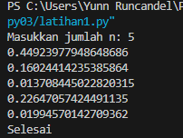
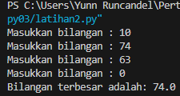
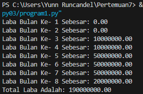

# Labspy03

## Latihan 1

## Kode Program

``````
import random

n = int(input("Masukkan jumlah n: "))

count = 0

while count < n:
    bilangan = random.random()
    if bilangan < 0.5:
        print(bilangan)
        count += 1

print("Selesai")
``````

## Maka Outputnya Adalah :



## Latihan  2
### Kode Program

``````
# Variabel untuk menyimpan bilangan terbesar
bilangan_terbesar = None

while True:
    angka = float(input("Masukkan bilangan : "))

    # Pengguna ingin menyelesaikan program
    if angka == 0:
        break

    # Memeriksa apakah angka yang dimasukkan lebih besar dari yang sebelumnya
    if bilangan_terbesar is None or angka > bilangan_terbesar:
        bilangan_terbesar = angka

if bilangan_terbesar is not None:
    print(f"Bilangan terbesar adalah: {bilangan_terbesar}")
else:
    print("Tidak ada bilangan yang dimasukkan.")
``````

### Maka Outputnya Adalah : 



## Program 1

### Kode Program

``````
modal_awal = 100_000_000  # Modal awal sebesar 100 juta
labas = []  # Daftar laba bulanan

# Perulangan dari bulan ke 1 hingga bulan ke 8
for bulan in range(1, 9):
    if bulan <= 2:
        laba = 0  # Bulan pertama dan kedua belum mendapatkan laba
    elif bulan == 3:
        laba = modal_awal * 0.1  # Bulan ketiga mendapatkan laba sebesar 1%
    elif bulan == 5:
        laba = modal_awal * 0.5  # Bulan kelima mendapatkan laba sebesar 5%
    elif bulan == 8:
        laba = modal_awal * 0.5 * 0.4  # Bulan kedelapan mengalami penurunan 2%
    else:
        laba = labas[bulan - 2]  # Laba bulan sebelumnya

    labas.append(laba)

#Print hasil laba bulanan
for bulan, laba in enumerate(labas, start=1):
    print(f"Laba Bulan Ke- {bulan} Sebesar: {laba:.2f}")

total_laba = 0

for laba in labas:
    total_laba += laba

print(f"Total Laba Adalah: {total_laba:.2f}")
``````

### Maka Outputnya Adalah : 


