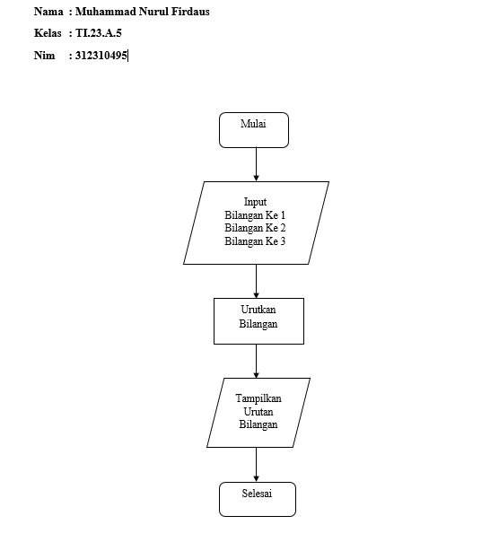
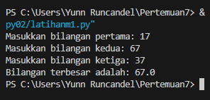

# Pertemuan 7 Bahasa Pemrograman
# Praktikum 2
## Program untuk menentukan bilangan terbesar dari tiga bilangan
### Flowchartnya:



### Programnya:
``````python
# Membaca input dari pengguna
bilangan1 = float(input("Masukkan bilangan pertama: "))
bilangan2 = float(input("Masukkan bilangan kedua: "))
bilangan3 = float(input("Masukkan bilangan ketiga: "))

# Mencari bilangan terbesar
if bilangan1 >= bilangan2 and bilangan1 >= bilangan3:
    terbesar = bilangan1
elif bilangan2 >= bilangan1 and bilangan2 >= bilangan3:
    terbesar = bilangan2
else:
    terbesar = bilangan3

# Menampilkan hasil
print("Bilangan terbesar adalah:", terbesar)
``````
## Maka Outputnya Adalah :

